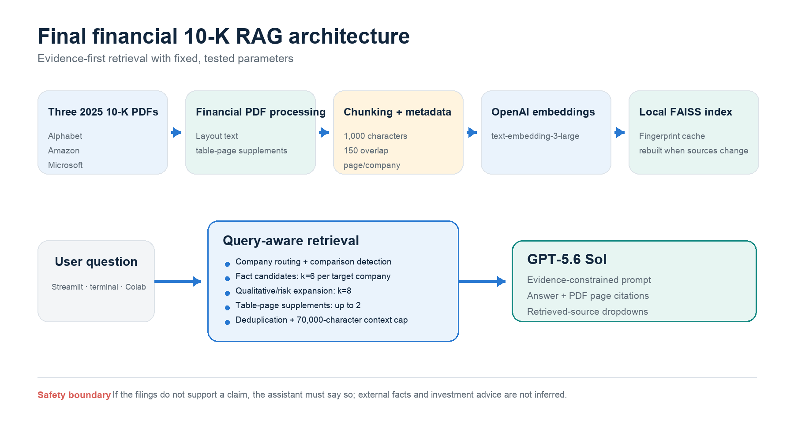
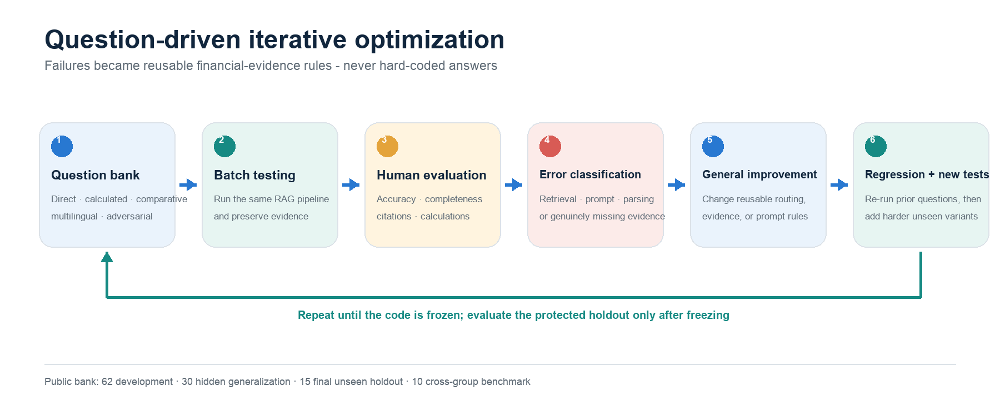
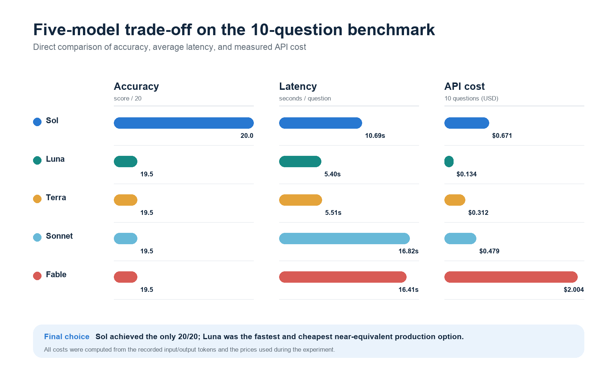

# Financial 10-K RAG Assistant

An evidence-grounded retrieval-augmented generation system for the 2025 Form 10-K filings of Alphabet, Amazon, and Microsoft. The final configuration uses **GPT-5.6 Sol**, **OpenAI `text-embedding-3-large`**, a local **FAISS** vector store, and finance-aware retrieval rules designed to reduce unsupported comparisons, year/column confusion, and false-premise acceptance.



The implementation is organized as one reusable package shared by every interface. See
[`docs/architecture.md`](docs/architecture.md) for the current component boundaries, index
lifecycle, evidence contract, failure policy, and design trade-offs.

## What it can do

- Answer direct, calculated, comparative, multilingual, qualitative, and adversarial questions using only the supplied filings.
- Show PDF-file and page citations and retain the retrieved chunks for every message in Streamlit history.
- Run locally in a browser, in macOS/Windows/Linux terminals, in the VS Code terminal, or in Google Colab.
- Accept replacement copies of the same three verified 2025 filings through Streamlit without editing code.
- Reuse a fingerprinted FAISS cache when the source files and retrieval configuration are unchanged.
- Export a Streamlit conversation as CSV.
- Run all or selected questions from a public 117-question bank and export auditable CSV and Markdown results.

## Quick start

Python 3.11-3.13 is supported. From the repository root:

```bash
python -m venv .venv
source .venv/bin/activate        # Windows: .venv\Scripts\activate
python -m pip install --upgrade pip
pip install -e ".[dev]"
```

Set the key for the current terminal session:

```bash
export OPENAI_API_KEY="your-key-here"   # Windows PowerShell: $env:OPENAI_API_KEY="your-key-here"
```

Never commit a real API key. `.env` is ignored; `.env.example` documents the expected variable.

Runtime and development dependencies are declared only in `pyproject.toml`; the project does not maintain a second handwritten requirements file.

### Streamlit website

```bash
streamlit run app/streamlit_app.py
```

Open the local URL printed by Streamlit, normally `http://localhost:8501`. Entering the key in the sidebar is also supported; it is passed directly to the API clients for that Streamlit session and is not copied into process-wide environment variables or written to disk. The first run embeds the PDFs and can take several minutes. Later runs reuse `cache/faiss/`.

The cache stores the native FAISS index plus a JSON document mapping; it does not deserialize a Python pickle. Cache format changes deliberately trigger a one-time index rebuild.

Uploaded replacements are validated from their PDF contents, not just their filenames. Each set must contain exactly one 2025 Form 10-K for Alphabet, Amazon, and Microsoft; other periods are rejected to prevent incorrect company or fiscal-period metadata.

### Terminal or VS Code terminal

Interactive mode:

```bash
financial-rag-chat
```

One question and exit:

```bash
financial-rag-chat --question "What was Microsoft's Productivity and Business Processes segment revenue for fiscal year 2024?"
```

Add `--verbose` to either CLI mode when diagnosing index or retrieval failures. Operational logs go to stderr; answers and source previews remain on stdout. The equivalent module command is `python -m financial_rag.cli`. Run either command from the repository root so the default `data/10k/` path resolves correctly.

### Google Colab

Open [`notebooks/financial_10k_rag_colab.ipynb`](notebooks/financial_10k_rag_colab.ipynb) in Colab. The notebook supports either a public GitHub repository URL or direct upload of a repository ZIP. It installs the package, requests the API key securely, builds the index, and provides a text box and **Ask** button for questions. It deliberately avoids ngrok and Cloudflare tunnels; use the local Streamlit command when a full webpage is needed.

## Batch evaluation

Run all public questions:

```bash
python evaluation/run_evaluation.py --all
```

`--all` deliberately excludes the 15 protected holdout questions. Run a named development stage with `--stage`, or run the holdout only after freezing and committing the code:

```bash
python evaluation/run_evaluation.py --stage "Final unseen holdout" --acknowledge-holdout
```

Holdout execution refuses a dirty Git worktree. Every result row records the commit SHA, dirty state, and UTC run timestamp so the evaluation can be traced to an exact code version.

Run selected IDs or a short smoke test:

```bash
python evaluation/run_evaluation.py --questions CLASS-002,CLASS-005,CLASS-010
python evaluation/run_evaluation.py --all --limit 3
```

Add `--verbose` for diagnostic logs. Each run creates a CSV and a readable Markdown answer file under `outputs/` by default. The question bank exposes questions, reference answers, source references, stage labels, and review status in [`evaluation/question_bank.csv`](evaluation/question_bank.csv).

| Evaluation stage | Questions | Purpose |
|---|---:|---|
| Development | 62 | Direct facts, calculations, comparisons, multilingual and adversarial coverage |
| Hidden generalization | 30 | Broader phrasing and retrieval variations |
| Final unseen holdout | 15 | Cleaner post-freeze external check |
| Cross-group benchmark | 10 | Questions contributed by class groups |

Two reference answers are labeled `Needs review` because one asks for a future-profit scenario and one asks for investment selection; the system should state their evidence limits rather than present them as filing facts.

## Testing and CI

The deterministic suite does not require an API key:

```bash
pytest
ruff check .
ruff format --check .
```

Tests cover configuration validation, filing identity and period checks, PDF cleanup and table
fallbacks, company/query routing, financial evidence selection, context/source boundaries, safe
cache round trips and rejection paths, explicit credential handling, and holdout safeguards.
GitHub Actions runs dependency validation, lint, formatting, all tests, and an installed-CLI smoke
test on Python 3.11, 3.12, and 3.13. Live embedding and answer-generation tests are intentionally
excluded from CI because they are billable and model access depends on the account.

## Development method: questions drove every iteration



The system was improved through repeated question-based cycles: run a diverse bank, evaluate answers manually, classify the failure, convert it into a reusable financial-evidence rule, rerun regression questions, and add harder variants. The team changed company routing, table evidence, exact-caption preference, calculation checks, and prompt boundaries in response to recurring failure categories—not by inserting question-specific answers into the code.

The final unseen holdout is deliberately separated from the development loop. Once code is frozen, it should be run without further tuning to provide a cleaner measure of generalization.

## Final configuration

The reported retrieval settings are frozen in [`src/financial_rag/config.py`](src/financial_rag/config.py):

| Component | Setting |
|---|---|
| LLM | `gpt-5.6-sol` |
| Embeddings | `text-embedding-3-large` |
| Vector store | FAISS, saved locally with a source/config fingerprint |
| Chunk size / overlap | 1,000 / 150 characters |
| Fact candidates | `k=6` per target company, `fetch_k=24` |
| Comparison routing | Company-aware retrieval; `k=3` minimum per named company |
| Qualitative/risk expansion | `k=8` |
| Table-page supplements | Up to 2 |
| Context / answer caps | 70,000 context characters / 3,000 output tokens |
| Reasoning / verbosity | Medium / medium |

Only the model ID is exposed as a runtime choice. Retrieval parameters remain fixed so reproduced results use the tested final pipeline.

## Why the retrieval is finance-aware

Generic similarity search was not enough for multi-company 10-K questions. The final code adds:

- page and issuer metadata plus table-dense page supplements;
- company routing so comparisons retrieve evidence for every requested issuer;
- expansions for exact financial captions, tax reconciliations, cash-tax inputs, reportable segments, capex, risks, and qualitative prompts;
- deduplication and context limits;
- a 14-rule system prompt that requires units, periods, formulas, signed factors, exact captions, comparability caveats, and explicit refusal when evidence is incomplete.

These are general evidence rules, not hard-coded answers to the public questions.

## Results and model trade-offs



With the same final retrieval design and OpenAI embeddings, GPT-5.6 Sol was the only tested model to receive 20/20 on the ten-question human-reviewed benchmark. Luna, Terra, Claude Sonnet 5, and Claude Fable 5 each received 19.5/20. Sol was selected for maximum completion and rigor; Luna was about twice as fast and one-fifth the measured cost, making it the stronger commercial cost-latency alternative in this small benchmark.

The ten-question cost figures are experimental snapshots, not promises of current pricing. See [`results/README.md`](results/README.md), [`results/five_model_summary.csv`](results/five_model_summary.csv), and [`results/pre_post_comparison.csv`](results/pre_post_comparison.csv) for the recorded methodology and caveats.

## Repository map

```text
app/                     Streamlit interface
data/                    Three course-provided 2025 filings and integrity manifest
docs/                    Architecture, tech note, presentation guide, and figures
evaluation/              Public question bank and batch evaluator
notebooks/               Colab workflow
results/                 Curated final answers and experiment summaries
src/financial_rag/       Final reusable RAG package and terminal interface
tests/                   Retrieval and PDF-processing regression tests
.github/workflows/       Python 3.11-3.13 quality and test workflow
```

## Evidence boundary and limitations

- The assistant answers from the three bundled filings only; it is not a live market-data or web-search system.
- “Not found in retrieved context” is narrower than “not disclosed in the filing.” The prompt requires that distinction.
- Cross-company definitions and fiscal periods may not be directly comparable. The model must disclose those limitations.
- Forecasts and investment recommendations are not facts in a 10-K. If asked, the model should either refuse or clearly label a user-requested calculation as an illustrative scenario.
- The ten cross-group questions influenced the final retrieval improvements, so the post-improvement run is regression evidence rather than a fully unseen generalization estimate. Use the 15-question holdout after freezing code for a cleaner check.
- API calls are billable and model availability depends on the user's OpenAI account.

## Team

Johns Hopkins University, Carey Business School — BAAI, AI Essentials

| Team member | Primary contribution |
|---|---|
| Zhewei Hu | Financial retrieval optimization, multi-model evaluation, final repository integration |
| Shuai Yuan | OpenAI LLM/embedding experiments, parameter tests, evaluation support |
| Junwei Lin | PDF preprocessing, question-bank construction, validation |
| Yuhan Ding | Baseline financial RAG architecture and domain-evidence design |
| Shuying Chen | Error analysis, question-bank review, iterative improvement |
| Qige Wang | Streamlit/Colab workflow, documentation, presentation support |

Detailed design choices, failed approaches, prompt rules, evaluation chronology, strengths, weaknesses, and hallucination boundaries are documented in [`docs/tech_note.md`](docs/tech_note.md) and [`docs/tech_note.pdf`](docs/tech_note.pdf). A separate [`Chinese presentation guide`](docs/Financial_RAG_Presentation_Guide_CN.pdf) supports project walkthrough preparation.

No license is currently granted. The team can add one later if public reuse terms are agreed.
