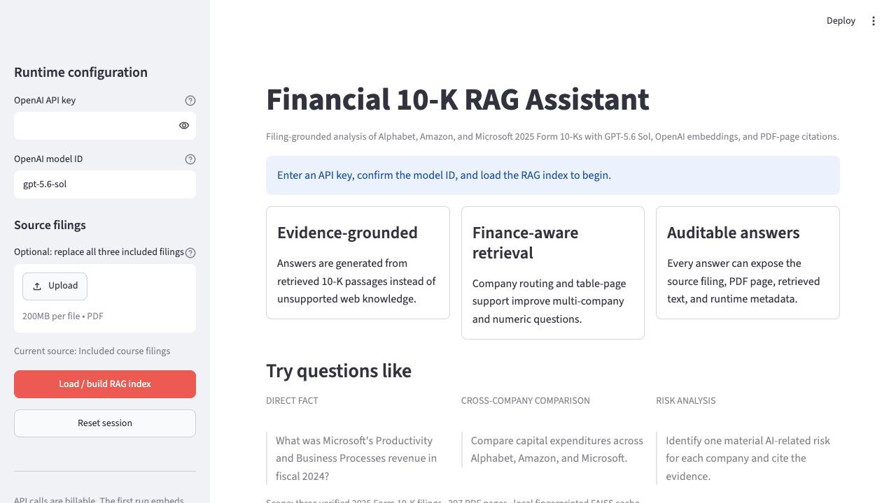

<div align="center">

# Financial 10-K RAG Assistant

[English](README.md) | [简体中文](README_CN.md)

**一个用于分析 Alphabet、Amazon 和 Microsoft 2025 年 Form 10-K 年报、以证据为基础的 AI 研究助手。**

[](https://github.com/junweilin1009-jpg/financial-10k-rag/actions/workflows/ci.yml)


[产品演示](#产品演示) · [系统架构](#系统架构) · [工程亮点](#工程亮点) · [评估结果](#评估与结果) · [本地运行](#本地运行) · [面试指南](docs/portfolio_interview_guide.md)

</div>



| 数据范围 | 评估题库 | 离线测试 | CI 测试矩阵 |
|---:|---:|---:|---:|
| **3 份年报 / 397 页** | **117 道问题** | **42 项测试** | **Python 3.11–3.13** |

## 为什么要做这个项目

年报中包含大量有价值的财务证据，但要找到一个准确答案，通常需要搜索数百页内容、理解复杂表格、核对报告期间，并比较披露方式并不完全相同的公司。

这个项目把年报转化为一套可以追踪证据的问答流程：

1. 验证公司、申报文件类型和报告期间；
2. 使用公司感知和财务感知规则检索证据；
3. 只根据检索到的上下文生成答案；
4. 展示来源 PDF、页码、证据预览和运行元数据。

它不是一个通用聊天机器人，而是一个专门的 RAG 系统，目标是让财务答案更容易核查、更难凭空编造。

## 产品演示

Streamlit 界面可以使用项目自带的三份年报，也可以接受经过验证的替代文件。它会创建或加载本地 FAISS 索引，为每条回答保留引用记录，保存对话，并支持将会话导出为 CSV。

示例问题包括：

- **直接事实：** Microsoft 2024 财年 Productivity and Business Processes 业务收入是多少？
- **跨公司比较：** 比较 Alphabet、Amazon 和 Microsoft 的资本性支出。
- **风险分析：** 分别指出三家公司的一项重要 AI 相关风险，并引用证据。
- **对抗性检查：** 询问年报没有支持的事实，检查系统是否会明确说明证据边界。

每条完整答案可以展示：

```text
回答
├── 模型、检索策略、延迟和 token 使用量
└── 检索来源
    ├── 公司和源文件名
    ├── PDF 页码和文档类型
    └── 证据预览
```

## 为什么它适合作为作品集项目

这个仓库不只是 Notebook 演示。网站、终端程序、Colab 工作流和批量评估程序都使用同一个经过测试的 Python 包。

| 领域 | 工程化设计 | 价值 |
|---|---|---|
| 输入安全 | 验证 PDF 内容、公司、文件类型和财务期间 | 防止文件名错误或期间错误的文档被静默加入索引 |
| 检索 | 识别问题中的公司，并补充表格密集页面 | 确保比较和数字类问题能获得每家目标公司的证据 |
| 证据边界 | 将模型回答与结构化来源记录分开 | 让引用可以核查，并避免把模型生成的文字当成证据 |
| 缓存安全 | 使用原生 FAISS 数据、JSON 元数据和数据/配置指纹 | 复用成本较高的 embeddings，同时避免反序列化不安全的 Python pickle |
| 可复现性 | 在评估结果中记录 commit SHA、工作区状态和 UTC 时间 | 将实验结果对应到准确的代码版本 |
| 质量门禁 | 执行 lint、格式检查、42 项确定性测试和已安装 CLI 冒烟测试 | 不消耗 API 费用也能发现回归问题 |
| Holdout 保护 | 15 道最终保留题需要显式确认且 Git 工作区必须干净 | 减少无意中针对最终评估集调参的风险 |

## 系统架构


整个流程分为四个阶段：文档验证与解析、带指纹的索引、财务感知检索，以及受证据约束的答案生成。`src/financial_rag/` 中的可复用包被所有运行界面共同使用。

组件边界、缓存生命周期、错误处理和设计取舍详见[架构文档](docs/architecture.md)和[技术说明](docs/tech_note.md)。

## 工程亮点

### 财务感知检索

普通的相似度搜索无法充分解决多公司 10-K 分析。最终检索器加入了公司路由、表格页面补充、精确财务标题信号、定性/风险问题扩展、去重和上下文限制。这些是可以复用的证据规则，不是针对评估题写死的答案。

### 用问题驱动迭代


团队反复运行不同类型的问题、人工检查答案、归类失败原因、把重复出现的失败转化为通用检索或 Prompt 规则，再重新运行回归问题。独立的 holdout 题库受到保护，用于代码冻结后的更严格检查。

### 明确的失败处理原则

系统会区分**“在当前检索上下文中没有找到”**与**“年报中没有披露”**。对于报告期间或指标定义差异，回答必须明确说明；系统也不能把预测或投资建议描述成年报中的事实。

## 评估与结果

公开问题库覆盖直接事实、计算、比较、多语言问题、定性分析和对抗性问题。

| 评估阶段 | 问题数量 | 用途 |
|---|---:|---|
| 开发集 | 62 | 核心财务问答和已知失败类型 |
| 隐藏泛化集 | 30 | 更广泛的表达方式和检索变化 |
| 最终未见 Holdout | 15 | 代码冻结后的泛化检查 |
| 跨组 Benchmark | 10 | 人工评审不同模型的表现 |


在使用相同检索流程和 embeddings 的情况下，GPT-5.6 Sol 在 10 道人工评审题中获得 **20/20**，另外四个模型获得 **19.5/20**。在这个小型实验中，Luna 的速度大约快一倍，测得成本约为五分之一，体现了质量、速度和成本之间的取舍。

这 10 道题影响了后续检索优化，因此优化后的分数属于回归证据，不能当作无偏准确率。成本数字也是实验快照，并不是当前价格承诺。完整方法和限制详见[结果说明](results/README.md)。

## 本地运行

支持 Python 3.11–3.13。

```bash
python -m venv .venv
source .venv/bin/activate        # Windows: .venv\Scripts\activate
python -m pip install --upgrade pip
pip install -e ".[dev]"
```

为当前终端设置 API Key。不要提交真实密钥；`.env` 已被 Git 忽略。

```bash
export OPENAI_API_KEY="your-key-here"   # PowerShell: $env:OPENAI_API_KEY="your-key-here"
```

启动网页：

```bash
streamlit run app/streamlit_app.py
```

也可以在终端中只提一个问题：

```bash
financial-rag-chat --question "Compare capital expenditures across the three companies."
```

第一次实时运行需要创建 embeddings，可能耗时数分钟。后续运行会复用 `cache/faiss/`。API 调用会产生费用，模型访问权限取决于用户的 OpenAI 账户。

### 其他使用方式

- **交互式终端：** 运行 `financial-rag-chat`。
- **Google Colab：** 打开 [Colab Notebook](notebooks/financial_10k_rag_colab.ipynb)。
- **批量评估：** 运行 `python evaluation/run_evaluation.py --all`。
- **短评估测试：** 运行 `python evaluation/run_evaluation.py --all --limit 3`。

`--all` 不包含受保护的 holdout。运行 holdout 需要使用 `--acknowledge-holdout`，并保持 Git 工作区干净。

## 无需 API Key 的测试

```bash
pytest
ruff check .
ruff format --check .
```

确定性测试覆盖配置、公司和财务期间验证、PDF 清理和表格回退、公司路由、证据选择、来源边界、安全缓存读写、凭证处理和 holdout 保护。GitHub Actions 会在 Python 3.11、3.12 和 3.13 上重复执行这些检查。

## 仓库结构

```text
app/                     Streamlit 产品界面
data/                    三份课程年报和数据完整性清单
docs/                    架构、技术说明、指南和图片
evaluation/              问题库和可复现批量评估程序
notebooks/               Google Colab 工作流
results/                 精选答案和实验结果
src/financial_rag/       可复用 RAG 包和终端界面
tests/                   确定性回归测试
.github/workflows/       多 Python 版本 CI 质量检查
```

## 项目背景和我的贡献

这个作品集版本来自 Johns Hopkins Carey Business School 的六人课程项目。我的工作重点是让源数据可以使用、评估过程更加可信，并让最终仓库达到适合公开展示的标准。

### 我的职责 — Junwei Lin

- **源数据准备：** 预处理并整理三家公司的年报，共 397 个 PDF 页面，为后续一致的文档解析和页码级证据追踪提供支持。
- **评估设计：** 参与构建分阶段的 117 题问题库，覆盖事实检索、计算、跨公司比较、多语言问题、定性分析和对抗性问题。
- **质量验证：** 检查参考答案、年报/页码来源和重复出现的失败类型，确保检索优化依据的是证据质量，而不仅是回答是否流畅。
- **作品集发布：** 为可复现性、安装、测试、文档、CI 和招聘者可读性定义验收标准，协调最终检查和 GitHub 公开发布。

这些工作把原始财务文件连接到可审计的评估流程，并帮助课程成果转变为其他读者可以检查、运行和在面试中讨论的工程项目。

| 团队成员 | 主要贡献 |
|---|---|
| Zhewei Hu | 财务检索优化、多模型评估、最终仓库集成 |
| Shuai Yuan | OpenAI LLM/embedding 实验、参数测试、评估支持 |
| **Junwei Lin** | **源数据准备、分阶段评估设计、证据验证、作品集发布验收** |
| Yuhan Ding | 基础金融 RAG 架构和领域证据设计 |
| Shuying Chen | 错误分析、问题库审查、迭代改进 |
| Qige Wang | Streamlit/Colab 工作流、文档和展示支持 |

项目的小白版说明、技术面试问题、STAR 故事和经过验证的简历表述，请查看[中文作品集与面试指南](docs/portfolio_interview_guide.md)。

## 使用范围、权利和限制

- 系统只根据项目中的三份年报回答问题，不是实时市场数据或网络搜索系统。
- 不同公司的指标定义和财务期间可能无法直接比较。
- 预测和投资建议不是 10-K 中的事实。
- 实时 embedding 和答案生成测试会产生费用，因此没有加入每次运行的 CI。
- 项目中的 PDF 是课程提供的资料，在更广泛地复用前应确认再分发权利。
- **目前没有授予开源许可证。** 公开仓库允许读者查看项目，但团队尚未定义代码复用权利。

发布检查和仍需处理的权利问题记录在[发布准备说明](docs/release_readiness.md)中。
