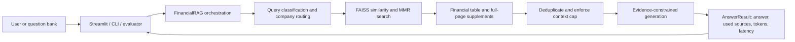
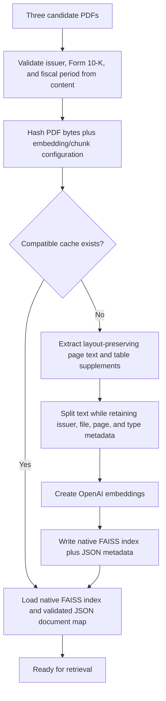

# Architecture and Engineering Decisions

This document describes the current repository implementation. The experiment history and
financial-retrieval methodology remain in [`tech_note.md`](tech_note.md).

## System context

The application answers questions against a fixed corpus of three 2025 Form 10-K filings. It is
an evidence-bounded analysis tool, not a live market-data system. Every public interface uses the
same `financial_rag` package so Streamlit, the terminal, Colab, and batch evaluation do not carry
separate retrieval implementations.

## Index lifecycle

The fingerprint uses each source filename and its bytes rather than timestamps, so touching
an unchanged filing does not invalidate the index while a name or content change does.
Retrieval-only settings are excluded from the fingerprint because they do not change stored
vectors.

## Package responsibilities

| Module | Responsibility |
|---|---|
| `config.py` | Validated, frozen runtime and retrieval settings |
| `filings.py` | Content-based corpus identity and reporting-period validation |
| `document_processing.py` | PDF text cleanup, page metadata, and table extraction |
| `index_cache.py` | Non-executable FAISS/JSON cache persistence and validation |
| `retrieval.py` | Company routing, intent detection, query expansion, and deduplication |
| `generation.py` | Context construction and provider-response normalization |
| `schemas.py` | Typed build, answer, and source contracts shared by interfaces |
| `engine.py` | Index/retrieval/generation orchestration and financial evidence supplements |
| `logging_config.py` | Minimal logging setup for application entrypoints |
| `cli.py` | Interactive and one-shot terminal interface |

`engine.py` remains the orchestration boundary because index construction and financial retrieval
share state (`vector_store`, complete table pages, and build metadata). Cache serialization and
generation normalization were extracted because they are stateless and independently testable.
Splitting the remaining financial rules into many small classes would add indirection without a
second retrieval backend or corpus to justify it.

## Evidence contract

1. Retrieval attaches issuer, source file, PDF page, fiscal period, and document type metadata.
2. Financial supplements add complete pages only when the question needs specific evidence such as
   a tax reconciliation, segment table, or cash-flow caption.
3. Context construction stops at the configured character boundary; it never skips an oversized
   earlier document to include a later one.
4. `AnswerResult.sources` is built only from documents actually sent to the model, not every
   retrieved candidate.
5. The prompt requires the model to distinguish absent context from a filing-wide absence and to
   reject unsupported forecasts or investment conclusions.

This contract makes page references an auditable trace of model inputs. It does not claim that a
page citation is formal entailment verification.

## Failure policy

Failures that threaten corpus identity or correctness stop the run with a clear exception:

- a missing, unreadable, wrong-issuer, wrong-form, or wrong-period PDF;
- invalid retrieval configuration;
- an incomplete or inconsistent cache mapping;
- missing credentials or inaccessible models;
- accidental holdout execution without acknowledgement, or holdout execution from a dirty tree.

Optional enrichment failures degrade visibly instead of silently. If table parsing fails, the
page's extracted text remains available and a warning identifies the file and page. If full-page
context expansion fails, the original retrieved chunks remain available and the failure is logged.
Entry points surface fatal API and pipeline errors without logging credentials, prompts, or answers.

## Configuration and secrets

`RAGConfig` is a frozen dataclass because the project has one tested configuration family and no
deployment matrix that would justify a YAML dependency. Values are validated when the object is
created. The OpenAI key comes from the process environment, a terminal prompt, or Streamlit's
password input and is passed directly to clients; the Streamlit path does not write it into global
environment state or to disk.

## Evaluation integrity

The public bank contains development, hidden-generalization, protected holdout, and cross-group
stages. `--all` excludes the protected holdout. A holdout run requires an explicit acknowledgement
and a clean committed worktree. Exported rows include UTC run time, commit SHA, and dirty status so
results can be traced to the exact code version.

No API-dependent evaluation runs in CI: they are billable, model access varies by account, and the
three-PDF embedding step is too expensive for every push. CI instead validates packaging, direct
dependencies, lint/format rules, deterministic unit and failure-path behavior, and the installed
CLI on Python 3.11-3.13.

## Reproducibility boundary

The repository can reproduce the code path, source corpus, tested configuration, question bank,
and recorded experiment artifacts. Exact future latency, price, token usage, and model output are
not guaranteed because hosted model behavior and pricing can change. The bundled filings were
course-provided; reuse rights and a repository software license must be decided before presenting
the repository as an unrestricted open-source release.
